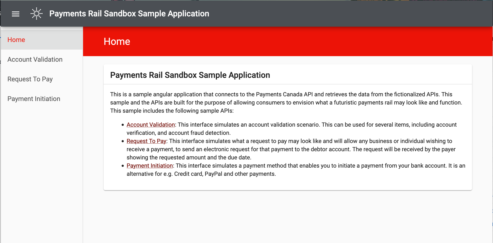

# Payments Rail Pages
This is a sample angular application that connects to the Payments Canada API and retrieves the data 
from the fictionalized APIs. These pages show you how this application looks like 

